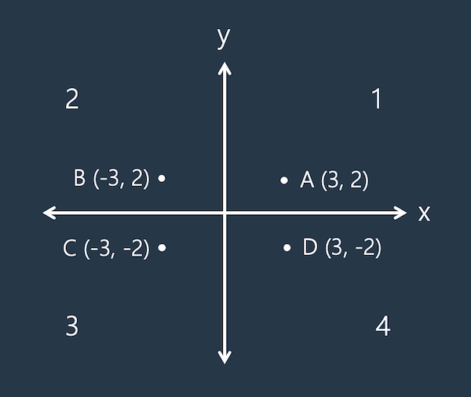

# [점의 위치 구하기](https://school.programmers.co.kr/learn/courses/30/lessons/120841)

## 개요
> ### 문제
> 사분면은 한 평면을 `x`축과 `y`축을 기준으로 나눈 네 부분입니다. 사분면은 아래와 같이 1부터 4까지 번호를매깁니다.
> 
> 
> 
> - `x` 좌표와 `y` 좌표가 모두 양수이면 제1사분면에 속합니다.
> - `x` 좌표가 음수, `y` 좌표가 양수이면 제2사분면에 속합니다.
> - `x` 좌표와 `y` 좌표가 모두 음수이면 제3사분면에 속합니다.
> - `x` 좌표가 양수, `y` 좌표가 음수이면 제4사분면에 속합니다.
>
> `x` 좌표 `(x, y)`를 차례대로 담은 정수 배열 `dot`이 매개변수로 주어집니다. 좌표 `dot`이 사분면 중 어디에 속하는지 `1`, `2`, `3`, `4` 중 하나를 `return` 하도록 `solution` 함수를 완성해주세요.
>
> **요약**: 한 점의 좌표 `(x, y)`가 주어질 때 해당 점이 몇 사분면에 존재하는지 구하기

> ### 주요 제한사항
> - 0 $\ne$ `x`, `y`

<h1 align="center"><br><br><br>❗️❗️ 스포주의 ❗️❗️<br><br><br></h1>

## 풀이
### 접근
- `y`나 `x`중에 먼저 판단해서 나온 두 개 중 나머지를 판단

### 코드
```python
def solution(dot):
    return [(2, 1), (3, 4)][dot[1] < 0][dot[0] > 0]
```

### 설명
1. `[dot[1] < 0]`: `y`가 양수면 거짓이므로 `0`이 되어 `(2, 1)`이 선택이 되고 음수면 반대로 `(3, 4)`가 선택이 된다.
2. `[dot[0] > 0]`: `x`가 양수면 참이므로 `1`이 되어 `y`에서 선택된 것 중 뒤에 것이 되고 음수면 반대로 앞에 것이 된다.

### 다른 사람 풀이 보고 느낀점
> .
