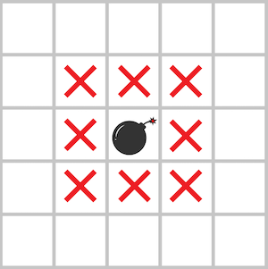

# [안전지대](https://school.programmers.co.kr/learn/courses/30/lessons/120866)

## 개요
> ### 문제
> 다음 그림과 같이 지뢰가 있는 지역과 지뢰에 인접한 위, 아래, 좌, 우 대각선 칸을 모두 위험지역으로 분류합니다.
> 
> 지뢰는 2차원 배열 `board`에 1로 표시되어 있고 `board`에는 지뢰가 매설 된 지역 1과, 지뢰가 없는 지역 0만 존재합니다.  
> 지뢰가 매설된 지역의 지도 `board`가 매개변수로 주어질 때, 안전한 지역의 칸 수를 `return`하도록 `solution` 함수를 완성해주세요.
>
> 요약: 지뢰가 매설된 지도 `board`가 주어질 때 안전한 지역의 칸 수 구하기

> # 주요 제한사항
> - `board`는 `n * n`

<h1 align="center"><br><br><br>❗️❗️ 스포주의 ❗️❗️<br><br><br></h1>

## 풀이
### 접근
- 위, 아래, 좌, 우, 대각선에 해당하는 `dx`, `dy` 설정
- 지뢰 위치 찾기
- 찾으면서 0 개수 세기
- 지뢰 위치에서 위험지대 `board`에 `-1`로 표시하기 $\to$ 표시한 만큼 0에서 빼기
- 0개수 반환

### 코드
```python
def solution(board):
    direction = [(-1, -1), (-1, 0), (-1, 1), (0, -1), (0, 1), (1, -1), (1, 0), (1, 1)]

    cnt_zero = 0
    bomb = []
    n = len(board)

    for y in range(n):
        for x in range(n):
            if board[y][x]:
                bomb.append((y, x))
            else:
                cnt_zero += 1

    for y, x in bomb:
        for dy, dx in direction:
            ny, nx = y + dy, x + dx
            if 0 <= ny < n and 0 <= nx < n and board[ny][nx] == 0:
                board[ny][nx] = -1
                cnt_zero -= 1

    return cnt_zero
```

### 설명
0. `y`, `x`는 리스트의 좌표값
1. 지뢰를 기준으로 주변 칸들을 `direction`에 저장
2. `board`를 돌면서 `board[y][x]`의 값이 1이면 해당 좌표를 `bomb`에 저장
3. 0이면 `cnt_zero`의 값을 `+1`
4. `board`를 다 돈 뒤 `bomb`에 저장된 좌표를 기준으로 주변을 위험지역으로 변경
   1. `if 0 <= ny < n and 0 <= nx < n and board[ny][nx] == 0` 위험지역으로 변경하는 기준
   2. `0 <= ny < n`, `0 <= nx < n`: `y`, `x`값이 `board`의 범위를 벗어나지 않도록
   3. `board[ny][nx]`: 해당칸이 0이 아니라면 바꿀 필요가 없으므로 0인 경우에만 변경
5. 이 과정에서 `cnt_zero`의 값을 `-1`

### 다른 사람 풀이 보고 느낀점
```python
for y in range(max(col-1,0),min(col+2,len(board))):
    for x in range(max(row-1,0),min(row+2,len(board))):
```
> 이런식으로 y, x를 아예 범위 안에만 오게 할 수 있다는 것을 배움
