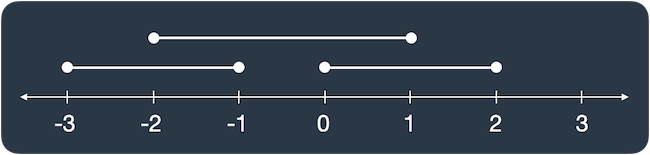

# [겹치는 선분의 길이](https://school.programmers.co.kr/learn/courses/30/lessons/120876)

## 개요
> ### 문제
> 
> 선분 3개가 평행하게 놓여 있습니다. 세 선분의 시작과 끝 좌표가 `[[start, end], [start, end], [start, end]]` 형태로 들어있는 2차원 배열 `lines`가 매개변수로 주어질 때, 두 개 이상의 선분이 겹치는 부분의 길이를 `return` 하도록 `solution` 함수를 완성해보세요.
>
> `lines`가 `[[0, 2], [-3, -1], [-2, 1]]`일 때 그림으로 나타내면 다음과 같습니다.
>
> 
>
> 선분이 두 개 이상 겹친 곳은 `[-2, -1], [0, 1]`로 길이 `2`만큼 겹쳐있습니다.
>
> 요약: 세 직선이 겹쳐있는 길이

> # 주요 제한사항
> $-100 <= a < b <= 100$

<h1 align="center"><br><br><br>❗️❗️ 스포주의 ❗️❗️<br><br><br></h1>

## 풀이
### 접근
- .

### 코드
```python
def solution(lines):
    answer = 0
    arr = [0] * 202
    for a, b in lines:
        for i in range(a+100, b+100):
            arr[i] += 1
    
    for i in arr:
        if i > 1:
            answer += 1
    return answer

    return sum(1 for i in arr if i > 1)
```

### 설명
1. 직선 세개가 놓여져 있는 곳이 배열이라고 생각하고 범위만큼 배열 생성 $\to$ `arr = [0] * 202`
2. `a` < `b` 이므로 `a`부터 `b`까지 `arr`에 `1`씩 더하기
3. `arr`을 순회하면서 `1`이상이면 겹친다는 뜻이므로 `answer`에 `+1`
4. 간단한 표현: `sum(1 for i in arr if i > 1)`
