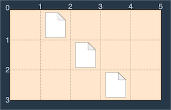
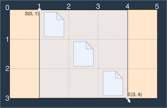

# [바탕화면 정리](https://school.programmers.co.kr/learn/courses/30/lessons/161990)

## 개요
> ### 문제
> 코딩테스트를 준비하는 머쓱이는 프로그래머스에서 문제를 풀고 나중에 다시 코드를 보면서 공부하려고 작성한 코드를 컴퓨터 바탕화면에 아무 위치에나 저장해 둡니다. 저장한 코드가 많아지면서 머쓱이는 본인의 컴퓨터 바탕화면이 너무 지저분하다고 생각했습니다. 프로그래머스에서 작성했던 코드는 그 문제에 가서 다시 볼 수 있기 때문에 저장해 둔 파일들을 전부 삭제하기로 했습니다.
>
> 컴퓨터 바탕화면은 각 칸이 정사각형인 격자판입니다. 이때 컴퓨터 바탕화면의 상태를 나타낸 문자열 배열 `wallpaper`가 주어집니다. 파일들은 바탕화면의 격자칸에 위치하고 바탕화면의 격자점들은 바탕화면의 가장 왼쪽 위를 `(0, 0)`으로 시작해 (세로 좌표, 가로 좌표)로 표현합니다. 빈칸은 `"."`, 파일이 있는 칸은 `"#"`의 값을 가집니다. 드래그를 하면 파일들을 선택할 수 있고, 선택된 파일들을 삭제할 수 있습니다. 머쓱이는 최소한의 이동거리를 갖는 한 번의 드래그로 모든 파일을 선택해서 한 번에 지우려고 하며 드래그로 파일들을 선택하는 방법은 다음과 같습니다.
>
> 드래그는 바탕화면의 격자점 `S(lux, luy)`를 마우스 왼쪽 버튼으로 클릭한 상태로 격자점 `E(rdx, rdy)`로 이동한 뒤 마우스 왼쪽 버튼을 떼는 행동입니다. 이때, "점 S에서 점 E로 드래그한다"고 표현하고 점 S와 점 E를 각각 드래그의 시작점, 끝점이라고 표현합니다.
>
> 점 `S(lux, luy)`에서 점 `E(rdx, rdy)`로 드래그를 할 때, "드래그 한 거리"는 `|rdx - lux| + |rdy - luy|`로 정의합니다.
>
> 점 S에서 점 E로 드래그를 하면 바탕화면에서 두 격자점을 각각 왼쪽 위, 오른쪽 아래로 하는 직사각형 내부에 있는 모든 파일이 선택됩니다.
>
> 예를 들어 `wallpaper = [".#...", "..#..", "...#."]`인 바탕화면을 그림으로 나타내면 다음과 같습니다.
> 
> 
> 
> 이러한 바탕화면에서 다음 그림과 같이 `S(0, 1)`에서 `E(3, 4)`로 드래그하면 세 개의 파일이 모두 선택되므로 드래그 한 거리 `(3 - 0) + (4 - 1) = 6`을 최솟값으로 모든 파일을 선택 가능합니다.  
> 
> 
> 
> `(0, 0)`에서 `(3, 5)`로 드래그해도 모든 파일을 선택할 수 있지만 이때 드래그 한 거리는 `(3 - 0) + (5 - 0) = 8`이고 이전의 방법보다 거리가 늘어납니다.
>
> 머쓱이의 컴퓨터 바탕화면의 상태를 나타내는 문자열 배열 `wallpaper`가 매개변수로 주어질 때 바탕화면의 파일들을 한 번에 삭제하기 위해 최소한의 이동거리를 갖는 드래그의 시작점과 끝점을 담은 정수 배열을 `return`하는 `solution` 함수를 작성해 주세요. 드래그의 시작점이 `(lux, luy)`, 끝점이 `(rdx, rdy)`라면 정수 배열 `[lux, luy, rdx, rdy]`를 `return`하면 됩니다.
>
> 요약: 격자로 이루어진 바탕화면에 놓인 파일들을 드래그하여 모두 선택할 수 있는 사각형의 최소값의 좌표

> # 주요 제한사항
> - `wallpaper[i][j]`는 바탕화면에서 `i + 1`행 `j + 1`열에 해당하는 칸의 상태를 나타냅니다.

<h1 align="center"><br><br><br>❗️❗️ 스포주의 ❗️❗️<br><br><br></h1>

## 풀이
### 접근
- 배열을 순회하면서 `"#"`이 나오면 그 때 `min`, `max`를 활용해서 바로바로 좌표를 구하자

### 코드
```python
def solution(wallpaper):
    right = bottom = -1
    top = left = 55
    
    for y in range(len(wallpaper)):
        for x in range(len(wallpaper[y])):
            if wallpaper[y][x] == "#":
                top = min(top, y)
                bottom = max(bottom, y+1)
                left = min(left, x)
                right = max(right, x+1)
    
    return [top, left, bottom, right]
```

### 설명
1. `top`, `left`, `bottom`, `right`를 범위 밖의 값으로 설정
2. `wallpaper`를 순회하면서 `"#"`이 나올 때 마다 좌표값 변경
3. 최종 좌표값을 리턴

### 다른 사람 풀이 보고 느낀점
```python
def solution(wallpaper):
    res_y = set()
    res_x = set()
    
    for y in range(len(wallpaper)):
        for x in range(len(wallpaper[y])):
            if wallpaper[y][x] == "#":
                res_y.add(y)
                res_x.add(x)
    
    return [min(res_y), min(res_x), max(res_y)+1, max(res_x)+1]
```
> 간단한 방법을 더 떠올려보자