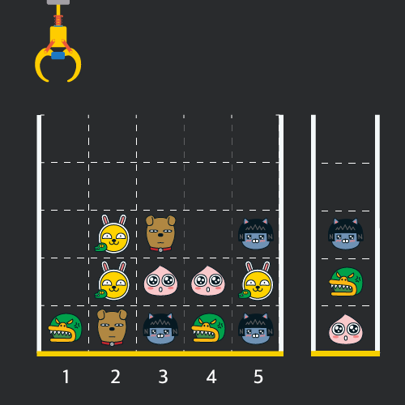

# [크레인 인형뽑기 게임](https://school.programmers.co.kr/learn/courses/30/lessons/64061)

## 개요
> ### 문제
> 게임개발자인 "죠르디"는 크레인 인형뽑기 기계를 모바일 게임으로 만들려고 합니다.  
> "죠르디"는 게임의 재미를 높이기 위해 화면 구성과 규칙을 다음과 같이 게임 로직에 반영하려고 합니다.
> 
> 
> 
> 게임 화면은 **"1 x 1"** 크기의 칸들로 이루어진 **"N x N"** 크기의 정사각 격자이며 위쪽에는 크레인이 있고 오른쪽에는 바구니가 있습니다. (위 그림은 "5 x 5" 크기의 예시입니다). 각 격자 칸에는 다양한 인형이 들어 있으며 인형이 없는 칸은 빈칸입니다. 모든 인형은 "1 x 1" 크기의 격자 한 칸을 차지하며 **격자의 가장 아래 칸부터 차곡차곡 쌓여 있습니다.** 게임 사용자는 크레인을 좌우로 움직여서 멈춘 위치에서 가장 위에 있는 인형을 집어 올릴 수 있습니다. 집어 올린 인형은 바구니에 쌓이게 되는 데, 이때 바구니의 가장 아래 칸부터 인형이 순서대로 쌓이게 됩니다. 다음 그림은 `[1번, 5번, 3번]` 위치에서 순서대로 인형을 집어 올려 바구니에 담은 모습입니다.
> 
> 
> 
> 만약 같은 모양의 인형 두 개가 바구니에 연속해서 쌓이게 되면 두 인형은 터뜨려지면서 바구니에서 사라지게 됩니다. 위 상태에서 이어서 `[5번] `위치에서 인형을 집어 바구니에 쌓으면 같은 모양 인형 **두 개**가 없어집니다.
> 
> 
> 
> 크레인 작동 시 인형이 집어지지 않는 경우는 없으나 만약 인형이 없는 곳에서 크레인을 작동시키는 경우에는 아무런 일도 일어나지 않습니다. 또한 바구니는 모든 인형이 들어갈 수 있을 만큼 충분히 크다고 가정합니다. (그림에서는 화면표시 제약으로 5칸만으로 표현하였음)
> 
> 게임 화면의 격자의 상태가 담긴 2차원 배열 `board`와 인형을 집기 위해 크레인을 작동시킨 위치가 담긴 배열 `moves`가 매개변수로 주어질 때, 크레인을 모두 작동시킨 후 터트려져 사라진 인형의 개수를 `return` 하도록 `solution` 함수를 완성해주세요.
>
> 요약: 인형을 뽑아서 바구니에 넣을 때 똑같은 인형이 연속으로 두개가 들어오면 두 인형은 터져서 사라진다. `moves`에 적혀 있는 순서대로 해당 칸에서 인형을 뽑을 때(해당 칸에 인형이 없으면 다음 순서로 넘어감) 터져서 사라진 인형의 총 개수를 구하라

> # 주요 제한사항
> .

<h1 align="center"><br><br><br>❗️❗️ 스포주의 ❗️❗️<br><br><br></h1>

## 풀이
### 접근
- 인형을 뽑을 칸이 세로이므로 인형이 들어있는 정보를 `board`에서 추출해 가로형식으로 정리
- 뽑힌 인형을 스택형식으로 저장해 뽑은 인형과 가장 위 칸에 있는 인형 비교해서 `pop`
- `pop` 발생시 결과에 `+2`

### 코드
```python
def solution(board, moves):
    board.reverse()
    box = []
    for x in range(len(board[0])):
        box.append([])
        for y in range(len(board)):
            if board[y][x]:
                box[x].append(board[y][x])

    answer = 0
    basket = []
    for i in moves:
        i -= 1
        if len(box[i]):
            pick = box[i].pop()
            if len(basket) and basket[-1] == pick:
                basket.pop()
                answer += 2
            else:
                basket.append(pick)
    return answer
```

### 설명
1. 인형을 칸별로, 뽑힐 순서대로 저장하기 위한 `box` 생성
2. `board.reverse()`: 인형을 `box`에 저장하기 편하게 거꾸로 뒤집어주기  
  $\to$ 밑에서부터 저장해야 가장 마지막에 뽑히기 때문
3. `box`에 0을 제외한 인형 정보 저장
4. `move`를 돌면서 `box`의 `i`번 째 칸에 인형이 있느지 확인: `if len(box[i])`
5. 인형이 있다면 `basket`의 마지막 인형과 비교
6. 같다면 `pop`하고 결과에 `+2`
7. 인형이 없거나 같지 않으면`basket`에 인형 추가

### 다른 사람 풀이 보고 느낀점
> 애초에 `box`를 만드는 것이 아니라 `board`자체에서 해결할 생각을 해봤으면 좋았을 거 같기도 함
> `box`에 넣을 때고 `y`값을 `len(board) - 1`부터 시작해서 0까지 하면 되는데 굳이 왜 뒤집었지? 싶음...
