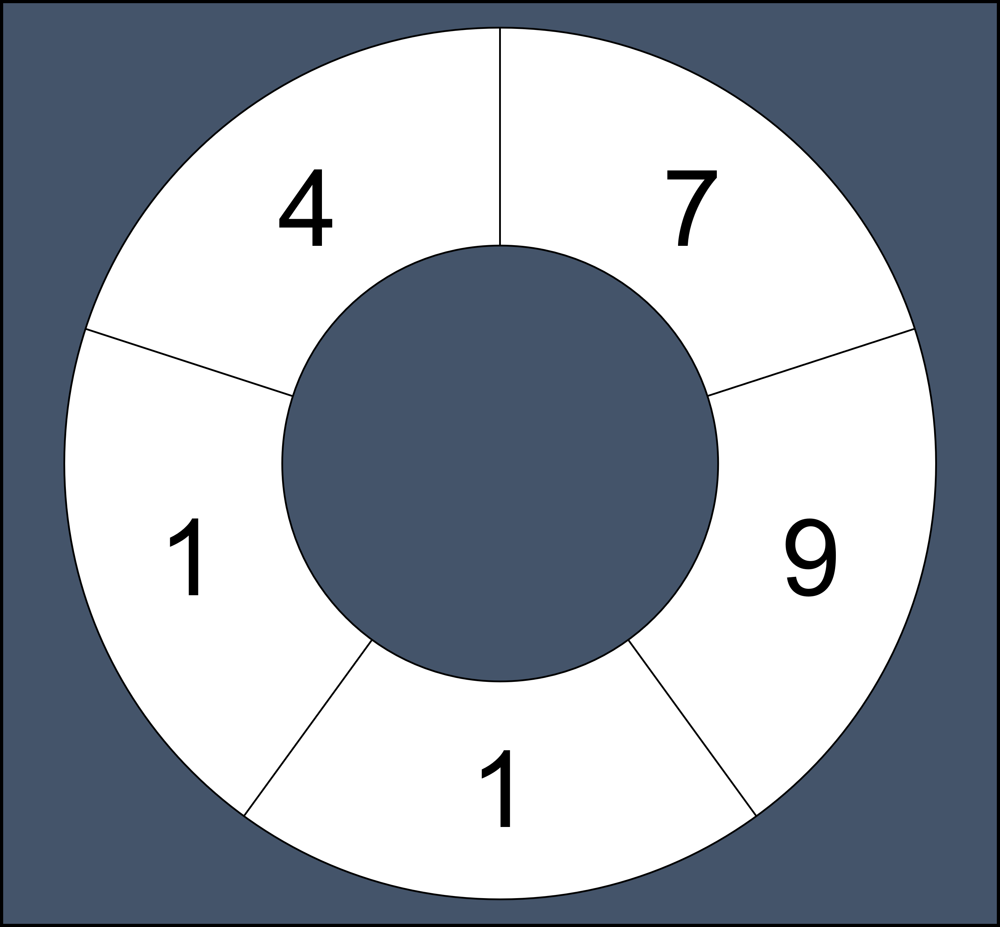

# [연속 부분 수열 합의 개수](https://school.programmers.co.kr/learn/courses/30/lessons/131701)

## 개요
> ### 문제
> 철호는 수열을 가지고 놀기 좋아합니다. 어느 날 철호는 어떤 자연수로 이루어진 원형 수열의 연속하는 부분 수열의 합으로 만들 수 있는 수가 모두 몇 가지인지 알아보고 싶어졌습니다. 원형 수열이란 일반적인 수열에서 처음과 끝이 연결된 형태의 수열을 말합니다. 예를 들어 수열 `[7, 9, 1, 1, 4]` 로 원형 수열을 만들면 다음과 같습니다.
> 
> 원형 수열은 처음과 끝이 연결되어 끊기는 부분이 없기 때문에 연속하는 부분 수열도 일반적인 수열보다 많아집니다.  
> 원형 수열의 모든 원소 `elements`가 순서대로 주어질 때, 원형 수열의 연속 부분 수열 합으로 만들 수 있는 수의 개수를 `return` 하도록 `solution` 함수를 완성해주세요.  
>
> **요약**: 주어진 원형 수열이 가질 수 있는 부분 수열의 개수

> ### 주요 제한사항
> .

<h1 align="center"><br><br><br>❗️❗️ 스포주의 ❗️❗️<br><br><br></h1>

## 풀이
### 접근
- 똑같은 배열을 하나 더 붙여서 배열이 이어지는 것 처럼 만들어야겠다.
  - `[7, 9, 1, 1, 4, 7, 9, 1, 1, 4]`
- 원래 배열의 길이 까지만 부분수열 만들기
- 중복 제거를 위해 `set` 처리

### 코드
```python
def solution(elements):
    res = []
    l = len(elements)
    elements += elements
    for i in range(1, l+1):
        for j in range(l):
            res.append(sum(elements[j:j+i]))
    return len(set(res))
```

### 설명
1. `l`: 부분 수열의 최대 길이(원본 `elements`의 길이)
2. `i`: 부분 수열의 길이 (`1 ~ l`)
3. `j`: 부분 수열의 시작 지점
4. `len(set(res))`: 중복 제거 후 개수

### 다른 사람 풀이 보고 느낀점
> 굳이 배열을 하나 더 만들지 않고 `%` 연산을 통해 반복문 돌리는 방법이 더 깔끔했을 거 같기도 함