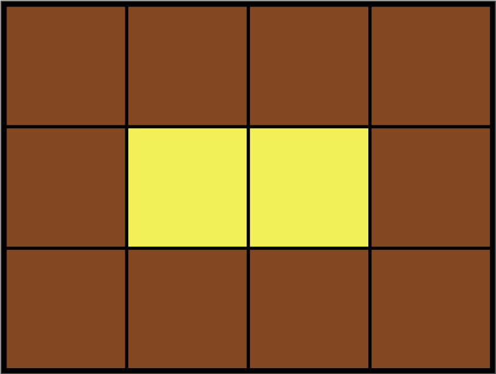

# [카펫](https://school.programmers.co.kr/learn/courses/30/lessons/42842)

## 개요
> ### 문제
> Leo는 카펫을 사러 갔다가 아래 그림과 같이 중앙에는 노란색으로 칠해져 있고 테두리 1줄은 갈색으로 칠해져 있는 격자 모양 카펫을 봤습니다.
> 
> Leo는 집으로 돌아와서 아까 본 카펫의 노란색과 갈색으로 색칠된 격자의 개수는 기억했지만, 전체 카펫의 크기는 기억하지 못했습니다.
>
> Leo가 본 카펫에서 갈색 격자의 수 `brown`, 노란색 격자의 수 `yellow가` 매개변수로 주어질 때 카펫의 가로, 세로 크기를 순서대로 배열에 담아 `return` 하도록 `solution` 함수를 작성해주세요.
> 요약: 카펫의 색칠된 칸의 개수가 테두리는 `brown`, 나머지 중앙은 `yellow`일 때 타일의 가로, 세로를 구하라

> # 주요 제한사항
> 가로는 세로보다 크거나 같다.

<h1 align="center"><br><br><br>❗️❗️ 스포주의 ❗️❗️<br><br><br></h1>

## 풀이
### 접근
- 타일의 총 개수: `brown` + `yellow`
- 테두리의 개수: $\lbrace(가로 + 세로)\ \times\ 2\rbrace\ -\ 4$
- 테두리의 개수가 `brown`가 맞는지 확인 후 결과 도출

### 코드
```python
def solution(brown, yellow):
    s = brown + yellow
    for i in range(1, s//2):
        j = s / i
        if j % 1 == 0 and (i+j) * 2 - 4 == brown:
            return [j, i]

```

### 설명
1. `brown`과 `yellow`를 더해 칸의 총 개수 구하기
2. 가로: `j` 세로: `j`
3. `j`가 정수여야하므로 식(`j % 1 == 0`)을 통해 검사
4. 테두리(`(i+j) * 2 - 4`)가 `brown`과 같으면 정답이므로 결과 리턴

### 다른 사람 풀이 보고 느낀점
> .
