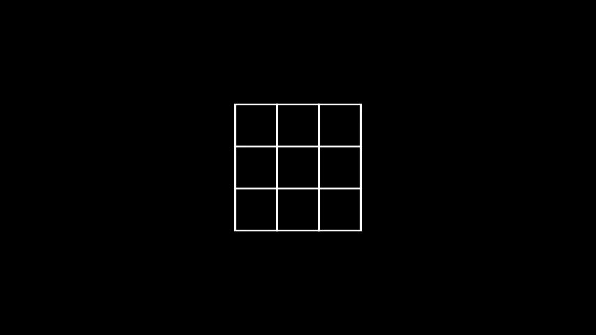
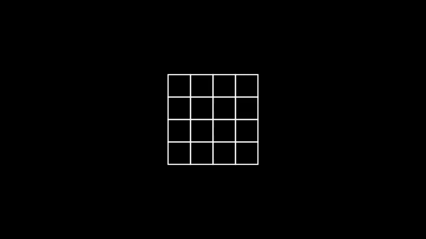

# [n^2 배열 자르기](https://school.programmers.co.kr/learn/courses/30/lessons/87390)

## 개요
> ### 문제
> 정수 `n`, `left`, `right가` 주어집니다. 다음 과정을 거쳐서 1차원 배열을 만들고자 합니다.
> 
> 1. `n`행 `n`열 크기의 비어있는 2차원 배열을 만듭니다.
> 2. i = 1, 2, 3, ..., `n`에 대해서, 다음 과정을 반복합니다.
>    - 1행 1열부터 i행 i열까지의 영역 내의 모든 빈 칸을 숫자 i로 채웁니다.
> 3. 1행, 2행, ..., `n`행을 잘라내어 모두 이어붙인 새로운 1차원 배열을 만듭니다.
> 4. 새로운 1차원 배열을 `arr`이라 할 때, `arr[left]`, `arr[left+1]`, ..., `arr[right]`만 남기고 나머지는 지웁니다.
> 
> 정수 `n`, `left`, `right`가 매개변수로 주어집니다. 주어진 과정대로 만들어진 1차원 배열을 `return` 하도록 `solution` 함수를 완성해주세요.
>
> **요약**:  
> 에시 1) `n: 3, left: 2, right: 5`
> 
> 예시 2) `n: 4, left: 7, right: 14`	
> 

> ### 주요 제한사항
> - 1 $\le$ `n` $\le$ 10$^7$
> - 0 $\le$ `left` $\le$ `right` $\lt$ n$^2$
> - `right` $-$ `left` $\lt$ 10$^5$

<h1 align="center"><br><br><br>❗️❗️ 스포주의 ❗️❗️<br><br><br></h1>

## 풀이
### 접근
- ~~반복문을 사용해서 2차원 배열같은 1차원 배열 만들기~~ $\to$ 시간 초과
- 규칙을 찾아보니 해당 칸은 좌표(행, 열)중 큰 숫자
- 행: `(i + left) / n` | 열: `(i + right) % n`
> > |       |          1          |          2          |          3          |
> > | :---: | :-----------------: | :-----------------: | :-----------------: |
> > |   1   | 1 (<big>**1**</big>, 1) | 2 (1, <big>**2**</big>) | 3 (1, <big>**3**</big>) |
> > |   2   | 2 (<big>**2**</big>, 1) | 2 (<big>**2**</big>, 2) | 3 (2, <big>**3**</big>) |
> > |   3   | 3 (<big>**3**</big>, 1) | 3 (<big>**3**</big>, 2) | 3 (<big>**3**</big>, 3) |


### 코드
```python
def solution(n, left, right):
    return [max(i // n, i % n) + 1 for i in range(left, right + 1)]
```

### 설명
1. `left` ~ `right` 사이의 `(행, 열)`의 좌표를 구한 뒤 둘 중 큰 값을 배열에 저장

### 다른 사람 풀이 보고 느낀점
> .
